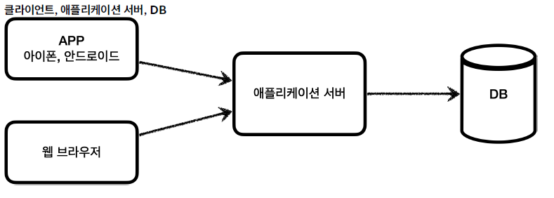

# JDBC 이해

애플리케이션을 개발할 때 중요한 데이터는 데이터베이스에 보관한다.




애플리케이션 서버와 DB의 문제점은 DB가 변경될 때 발생한다. 예전에는 데이터베이스마다 커넥션을 연결하는 방법, SQL을 전달하는 방법, 그리고 결과를 응답받는 방법 등이 모두 달랐다.

→이러한 문제를 해결하기 위해 나온것이 **JDBC**라는 자바 표준이다.

### JDBC 표준 인터페이스

- JDBC(Java Database Connectivity)는 자바에서 데이터베이스에 접속할 수 있도록 하는 자바 API이다. JDBC는 데이터베이스에서 자료를 쿼리하거나 업데이트하는 방법을 제공한다.


대표적으로 3가지 기능을 표준 인터페이스로 정의한다.

- `java.sql.Connection` - 연결
- `java.sql.Statement`- SQL을 담은 내용
- `java.sql.ResultSet`- SQL 요청 응답

이러한 JDBC 표준 인터페이스를 통해 각각의 DB는 자신의 DB에 맞도록 구현체를 라이브러리로 제공한다. 이를 JDBC 드라이버라고 한다.

따라서 JDBC로 2가지 문제점을 해결할 수 있다.

1. DB 종류를 다른 것으로 변경하면 애플리케이션 서버의 데이터베이스 사용 코드도 변경해야 하는 문제 → 애플리케이션 로직은 JDBC 표준 인터페이스에만 의존하기 때문에 다른 DB를 사용할때는 JDBC 구현체만 변경하면 된다.(MySQL 드라이버에서 Oracle 드라이버로 갈아끼우는 느낌)
2. 각각의 DB마다 연결, 전달, 결과 응답 받는 방법을 새로 학습해야 하는 문제 → 개발자는 JDBC 표준 인터페이스 사용법만 학습하면 된다.

### JDBC와 데이터 접근 기술

- JDBC는 출시된지 오래된 기술이고 사용하는 법도 복잡하기 때문에 JDBC를 직접 사용하기 보다는 JDBC를 편하게 사용하는 다양한 기술을 이용한다. 대표적으로 SQL Mapper와 ORM이 있다.

**SQL Mapper**

장점

- JDBC를 편리하게 사용하도록 도와준다.
- SQL 응답 결과를 객체로 편리하게 변환해준다.
- JDBC의 반복 코드를 제거해준다.

단점

- 개발자가 직접 SQL을 작성해야한다.

대표 기술 - 스프링 JdbcTemplate, MyBatis …

ORM 기술

- ORM은 객체를 관계형 데이터베이스 테이블과 매핑해주는 기술이다. 이 기술 덕분에 개발자는 반복적인 SQL을 직접 작성하지 않고 ORM 기술이 개발자 대신 SQL을 동적으로 만들어 실행해준다.

대표 기술 - JPA, 하이버네이트, 이클립스링크 …

→ ORM은 쉬운 기술이 아니여서 깊이있는 학습이 필요함.

### 데이터베이스 연결

H2 데이터베이스를 이용해 연결시키기

```java
package hello.jdbc.connection;

public class ConnectionConst {
    public static final String URL = "jdbc:h2:tcp://localhost/~/test";
    public static final String USERNAME = "sa";
    public static final String PASSWORD = "";
}
```

```java
@Slf4j
public class DBConnectionUtil {
    public static Connection getConnection(){
        try {
            Connection connection = DriverManager.getConnection(URL, USERNAME, PASSWORD);
            log.info("get connection={}, class={}", connection, connection.getClass());
            return connection;
        } catch (SQLException e) {
            throw new IllegalStateException(e);
        }
    }
}
```

1. 데이터베이스에 연결하기 위해 JDBC가 제공하는 `DriverManager.getConnection()`을 사용한다.
2. DriverManager가 라이브러리에 있는 데이터베이스 드라이버를 찾아 해당하는 드라이버의 커넥션을 반환해준다.

드라이버 커넥션은 JDBC 표준 커넥션 인터페이스인 `java.sql.Connection` 인터페이스를 구현하고 있다.


이런식으로 인터페이스를 jdbc가 정의하고 각각의 데이터베이스 드라이버는 JDBC Connection 인터페이스를 구현한 구현체들을 제공하는것임

정리하자면,

1. 애플리케이션 로직에서 커넥션이 필요하면 DriverManager.getConnection() 호출
2. DriverManger는 라이브러리에 등록된 드라이버 목록을 자동으로 스캔, 드라이버들에게 파라미터 정보를 넘겨서 커넥션을 획득할 수 있는지 확인 → URL, 이름, 비밀번호 등 추가정보…
3. 찾은 커넥션 구현체 클라이언트로 반환